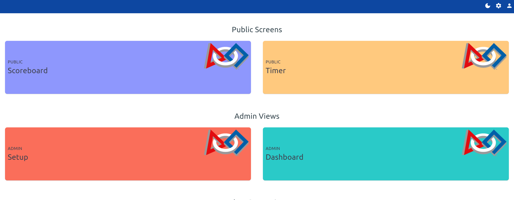
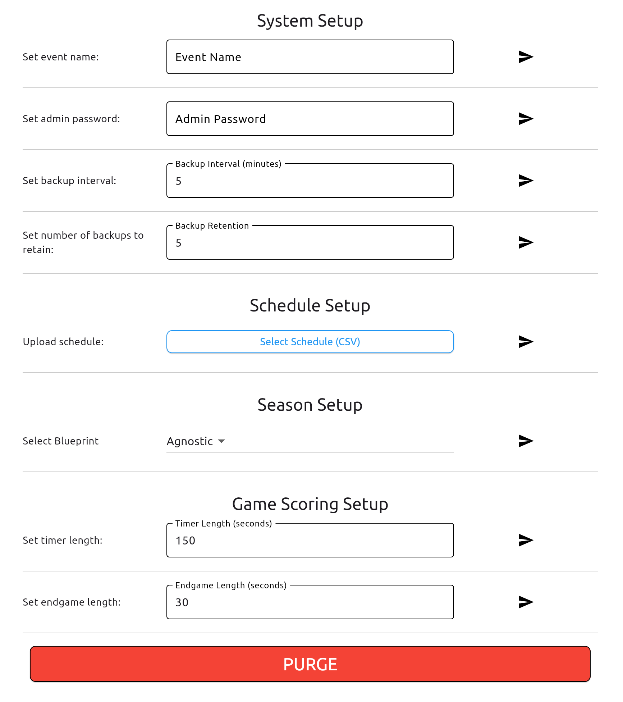
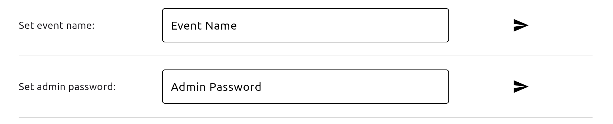

# Getting Started with Setup

## Navigate to the UI
After starting the TMS application, navigate to the address and the port number
```
http://localhost:8080
```

!!! info "Server Address"
    - If you enabled TLS, you may need to use `https://` instead. Be aware your browser may try to block you from accessing the site.
    - The default port is `8080`. If you have changed the port number, replace `8080` with the new port number.

!!! warning "External Access"
    If you are accessing the server from an external device, you will need to use the IP address of the server instead of `localhost`.

## Logging In
1. **Locate the Login Button**: Find the login button on the top right corner of the navbar.

    { width=400 }
    /// caption
    Login inputs
    ///

2. **Enter Your Credentials**: On first time startup the admin credentials are:
    - Username: `admin`
    - Password: `admin`

3. **Navigate to the Setup Page**: Once logged in, you will be redirected to the home screen.

    
    /// caption
    Home screen
    ///

    - From the home screen navigate to the Setup page under the `Admin Views` section.

4. **Configure the Event**: Here you can configure the event settings, such as the event name, the admin password, the schedule and game settings.

    !!! info "Mid Event Settings"
        You can also configure settings during an event at any time. Including changing the event name and the game settings. However, uploading a new schedule may provide undesired merged results

    !!! info "Individual Settings"
        Each setting has a send button to submit the change. Click the designated button to save the changes for that setting.

    { width=800 }
    /// caption
    Setup page
    ///

5. **(Optional) Input an Event Name & Admin Password**: 
    - You can enter an event name to be displayed on each display, this also is used to identify backups and exported items.
    - You can also update the admin password from it's default `admin`. This is recommended but not required.
    
    { width=800 }
    /// caption
    Event & Admin setup
    ///