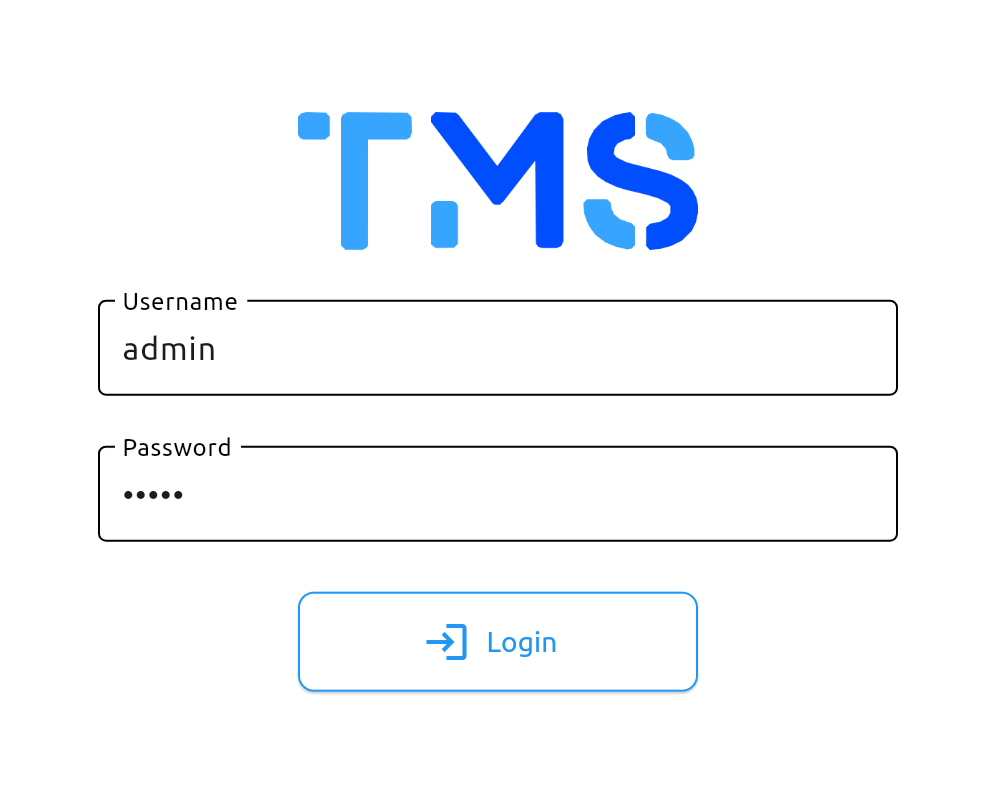
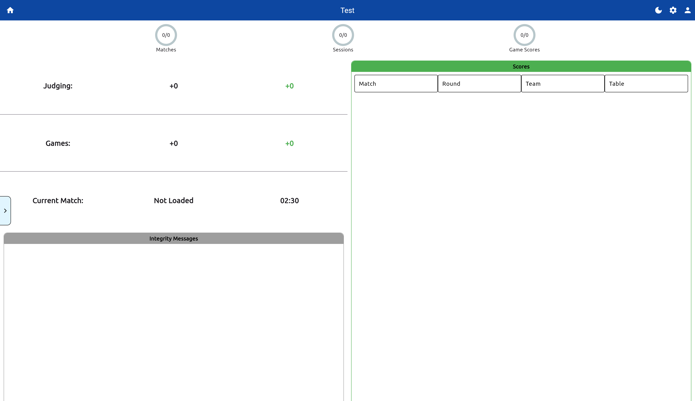
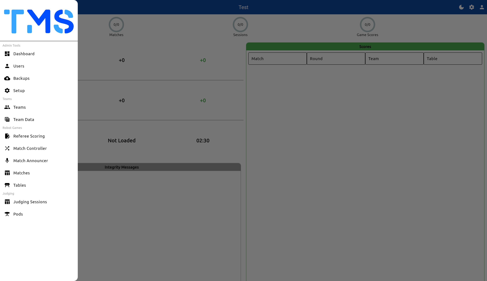
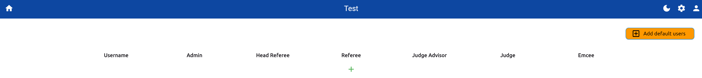
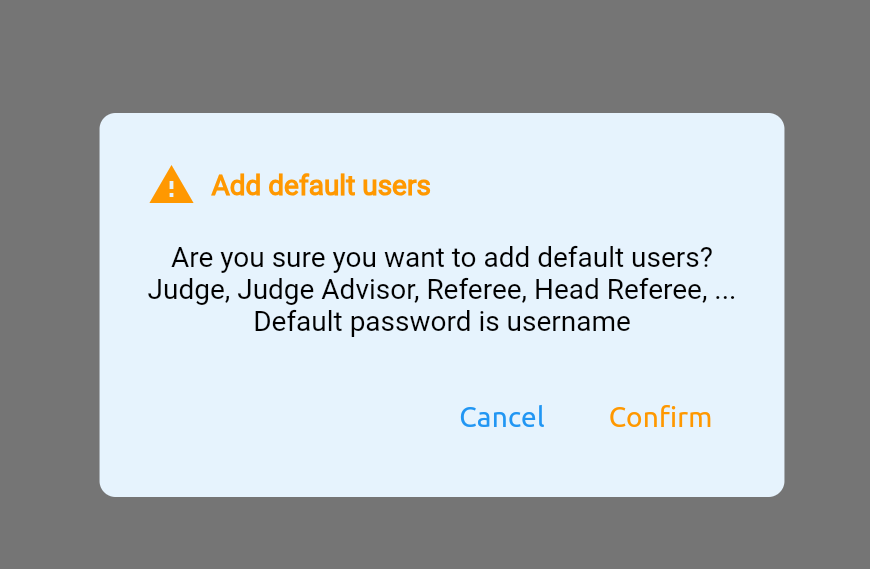

# Getting Started with Setup

## Navigate to the UI
After starting the TMS application, navigate to the address and the port number
```
http://localhost:8080
```

!!! info "Server Address"
    - If you enabled TLS, you may need to use `https://` instead. Be aware your browser may try to block you from accessing the site.
    - The default port is `8080`. If you have changed the port number, replace `8080` with the new port number.

!!! warning "External Access"
    If you are accessing the server from an external device, you will need to use the IP address of the server instead of `localhost`.

## Logging In
1. **Login**: Find the login button on the top right corner of the navbar.

    { width=400 }
    /// caption
    Login
    ///

2. **Enter Your Credentials**: On first time startup the admin credentials are:
    - Username: `admin`
    - Password: `admin`

3. **Navigate to the Setup Page**: Once logged in, you will be redirected to the home screen.

    
    /// caption
    Home screen
    ///

    - From the home screen navigate to the Setup page under the `Admin Views` section.

## Configure the Event
1. **Setup Screen**: From here you can configure the event settings, such as the event name, the admin password, the schedule and game settings.

    !!! info "Mid Event Settings"
        You can also configure settings during an event at any time. Including changing the event name and the game settings. However, uploading a new schedule may provide undesired merged results

    !!! info "Individual Settings"
        Each setting has a send button to submit the change. Click the designated button to save the changes for that setting.

    { width=800 }
    /// caption
    Setup screen
    ///

    Below lists the settings available for configuration:

    | Setting | Description |
    |---------|-------------|
    | Event Name | The name of the event used for each display and export. |
    | Admin Password | The admin user password. |
    | Backup Interval | Interval in minutes, in which TMS will perform a backup. |
    | Backup Retention | Number of backups to retain on the server device before replacing. |
    | Schedule | Upload a schedule file in **CSV** format to be used for the event. |
    | Blueprint | Select the blueprint for the event, using either agnostic or seasonal scoring. |
    | Timer length | The length of the total game timer in seconds. |
    | Endgame timer length | The trigger for endgame in seconds. |
    | PURGE | The purge button to delete and clean the database, resetting everything. |

2. **(Optional) Input an Event Name & Admin Password**: 
    - Enter an event name to be displayed for this tournament.
    !!! info "Event Name"
        The event name is also used to identify backups and exported items.
    - You can also update the admin password from it's default `admin`. This is recommended but not required.

## Users Setup
Users can be added and removed from the system. This is useful for adding additional admin users, referees, head referees and other volunteers without needing to share the default admin user and password.

1. **Navigate to the Admin Dashboard**: From the home screen, navigate to the Admin Dashboard under the `Admin Views` section.

    
    /// caption
    Admin Dashboard
    ///

2. **Navigate to the Users Screen**: From the Admin Dashboard, open the side navigation pane. Click on the `Users` option.

    
    /// caption
    Admin Dashboard - Navigation Pane
    ///

    !!! info "Navigation Pane"
        The navigation pane is available on all displays except for the home screen. It provides quick access to the different views shown on the home screen. As well as views not shown on the home screen.

3. **Add a User**: You can either add users one by one or add default users using the orange button on the top right corner.

    
    /// caption
    Add User
    ///

    - To add a user click the green `+` button. And enter a username and password.

    { width=400 }
    /// caption
    Add User
    ///

    - Alternatively, you can add a set of default users, such as referees, head referees, and volunteers by clicking the orange button on the top right corner.

    { width=400 }
    /// caption
    Add Default Users
    ///

    - After users have been added you can modify their roles using the checkboxes, and update their details using the edit button. Or remove them using the delete button.

    
    /// caption
    User Management
    ///

## Setup Complete
After the basic setup is complete, you can now start the event and begin using the system.
For issues or bugs, refer to the [Github Issues](https://github.com/CJBuchel/TMS/issues) or open a new issue.