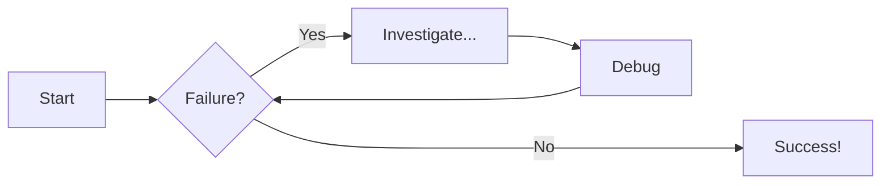
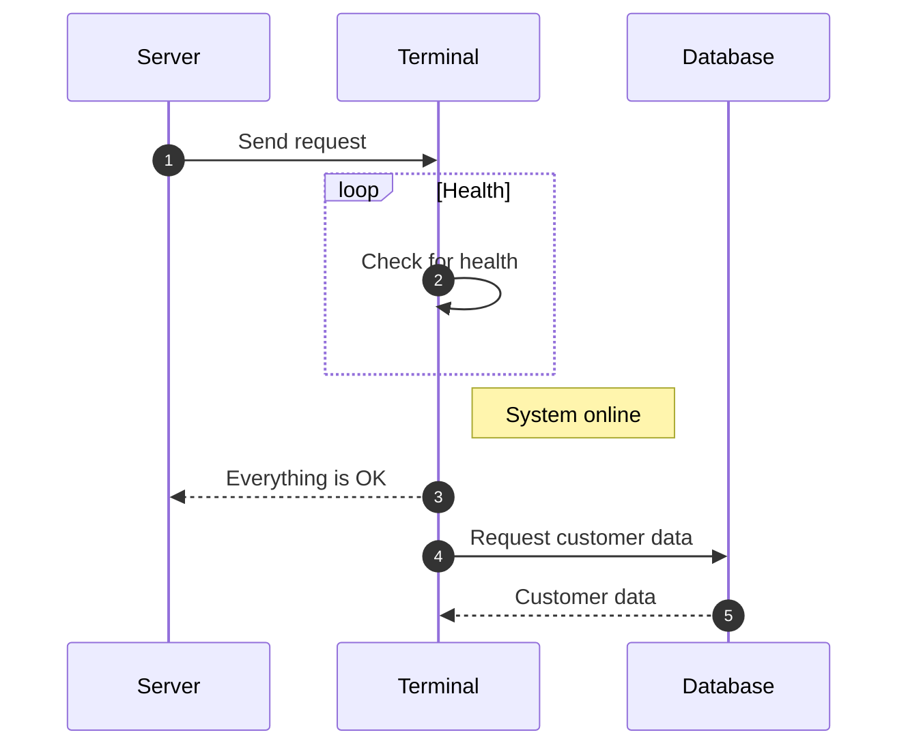

# Test examples

## Commands

- `mkdocs new [dir-name]` - Create a new project.
- `mkdocs serve` - Start the live-reloading docs server.
- `mkdocs build` - Build the documentation site.
- `mkdocs -h` - Print help message and exit.

## Project layout

    mkdocs.yml    # The configuration file.
    docs/
      index.md  # The documentation homepage.
      ...       # Other markdown pages, images and other files.

```py title="add numbers title.py" linenums="1"
# Generic python function
def add_two_numbers(num1, num2):
    return num1 + num2
```

### Content tabs
=== "Plain text"
    This is some plain text

=== "Unordered list"
    * First item
    * Second item
    * Third item

=== "Ordered list"
    1. First item
    2. Second item
    3. Third item

### Notes
!!! note "This is a note"
    Some note worthy text

!!! info "This is info"
    Some note worthy text

!!! warning "This is a warning"
    Some note worthy text

!!! danger "This is danger"
    Some note worthy text

!!! quote "This is a quote"
    Some note worthy text

??? note "This is a dropdown note"
    Some note worthy text

## Diagrams
### Flowchart

### Sequence Diagram
