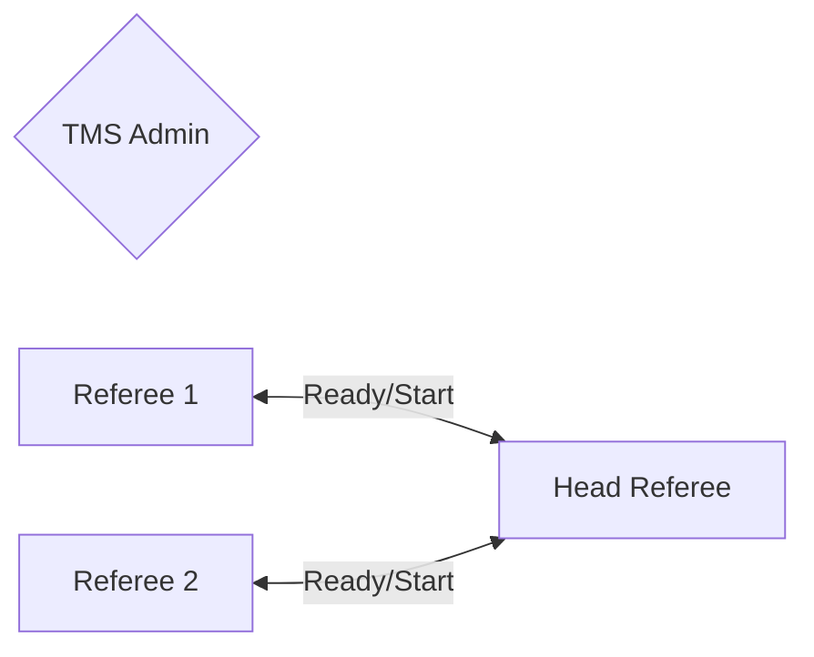
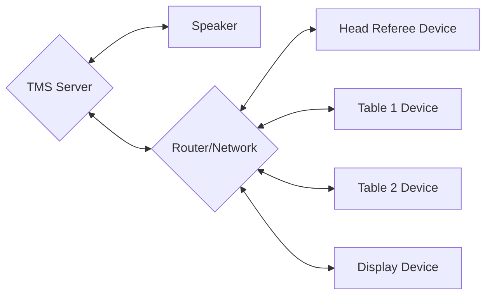

# Extended Setup
If you are using TMS for the Robot Games and have more volunteers and devices available for use. You can expand the setup to include more features and reduce strain on volunteers by spreading the load.
What many venues will do is also provide displays in the Game Area which can be used for either displaying the schedule, scores or the timer.
Below outlines an example setup with a reasonable amount of devices:

## Required Devices
- **Server**: A laptop or desktop to run the TMS software. And can be used to input/modify scores, and manage the schedule.
- **Speaker**: A speaker system to provide game sounds for teams and audiences. This can be connected to the server device or a dedicated separate device displaying the timer.
- **Network**: A wireless router to connect the server and scoring devices. Or a common venue network.
- **Head Referee Device**: A device to run the match timer and announce the match start. This can be a tablet or similar. It can also be used to reschedule teams on the fly.
- **Scoring Devices**: At least one device per table. This can be a laptop, tablet or similar. The recommendation is to use tablets with the web interface or iPads with the TMS App.
- **Display Devices**: TVs, projectors, etc. to display the scores and schedules to the audience. This can be a simple setup with a laptop and a TV, or a more complex setup with multiple displays.

## Volunteer Structure
A common structure for medium sized events is to have one person dedicated to running the TMS Software as the TMS Admin/Scorekeeper, who will manage the system and check scores. The Head Referee will have their own device to load and run matches. Along with scoring devices at each table.

!!! note "Head Referee Device"
    Using a dedicated Head Referee device is the recommended method to run matches. This allows the Head Referee to start the match when ready, and to reschedule matches and teams on the fly if needed. This structure also means the TMS Admin is no longer needed in the same room as the tables, and can focus on managing the system. Reducing the strain on the volunteers.

## Device Structure
In this setup, an example device structure can be seen below
