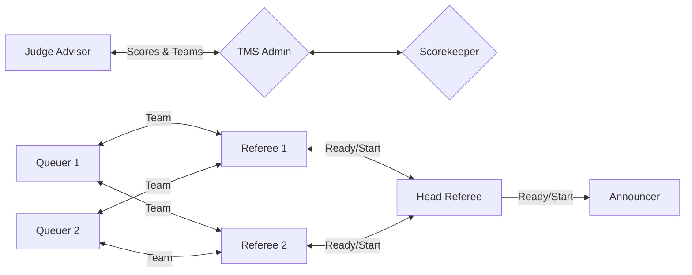
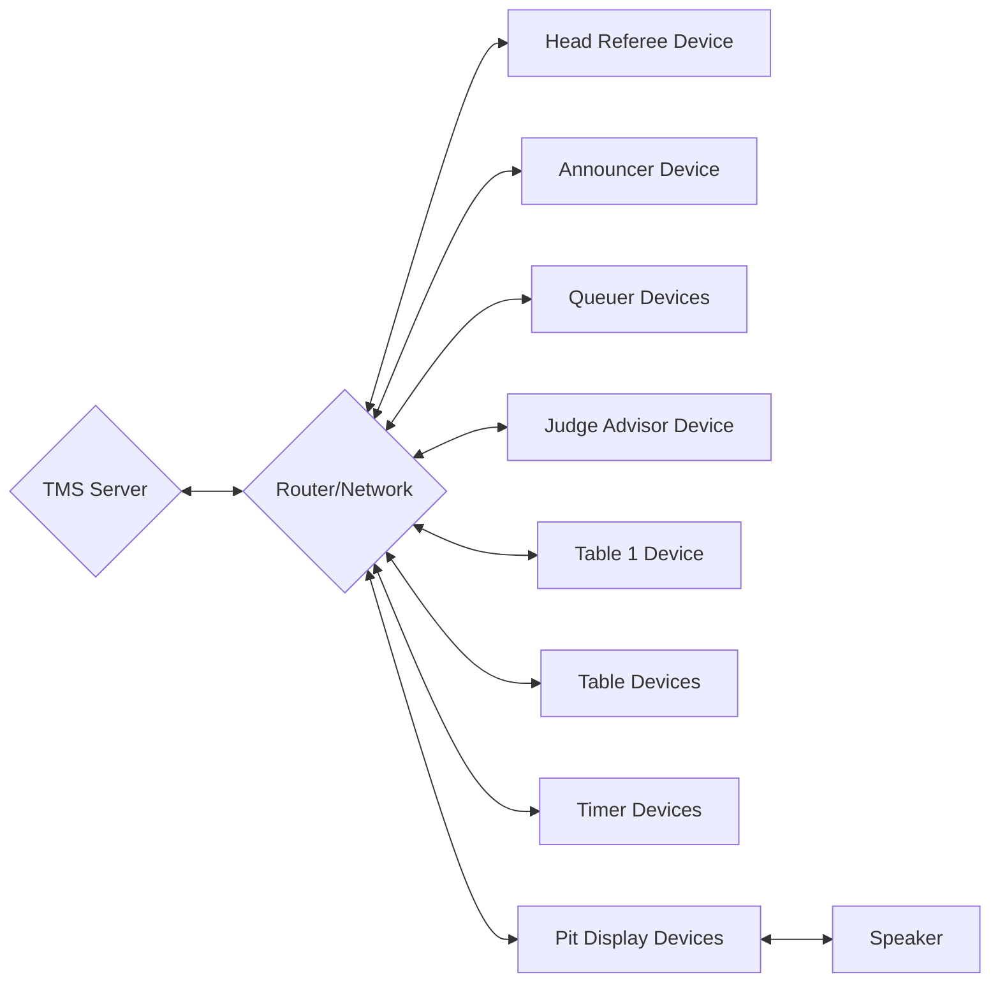

# Full Setup
In some scenarios TMS is deployed to a School, University or similar venue where a network is available and there are multiple areas with devices. Such as the Game Area with the Game Tables and displays for Timers. The Pits with the Audience display and Scoreboard. And in the Volunteer/Judging room where the Judge Advisor may access TMS to view/export the scores. In such cases for larger events, extra devices and volunteers can access the system for different purposes. Such as Queuers who can be given a device to view the live schedule to get teams to their sessions on time. Along with an Announcer who can view the current and next matches to announce to the audience.
In this setup, you will need:

- **Server**: A laptop or desktop to run the TMS software. And can be used to input/modify scores, and manage the schedule.
- **Speaker**: A speaker system to provide game sounds for teams and audiences. This can be connected to the server device or a dedicated separate device displaying the timer.
- **Network**: A wireless router to connect the server and scoring devices. Or a common venue network to connect all the devices to. (Every device will need to access the server on this network)
- **Head Referee Device**: A device to run the match timer and announce the match start. This can be a tablet or similar. It can also be used to reschedule teams on the fly.
- **Scoring Devices**: At least one device per table. This can be a laptop, tablet or similar. The recommendation is to use tablets with the web interface or iPads with the TMS App.
- **Announcer Device**: A device to view the current and next matches to announce to the audience. This can be a tablet or similar.
- **Queuer Devices**: Devices for the Queuers to view the live schedule and get teams to their judging sessions on time. This can be a tablet or similar.
- **Timer Devices**: Displays for the Game Area to show the timer and schedule. This can be a TV or projector.
- **Audience Displays**: Displays for the Pits to show the scores and schedule. This can be a TV or projector.
- **Judge Advisor Device**: A device for the Judge Advisor to view and export scores. The most common device should be a laptop to easily download the scores and print them if needed.

## Volunteer Structure
The volunteer structure for a full event is more complex but generally provides smooth operation keeping everything orderly and on time. The TMS Admin will manage the system and check scores along with a potential Scorekeeper. The Head Referee will direct referees and prepare matches in order to the schedule that they manage. Likewise Queuers who may be in communication to the Referees will be able to view the schedule and get teams to their sessions on time. An Announcer will be able to view the current match and in communication with the Head Referee will announce and start the match when ready. And separate to Games and Pits the Judge Advisor will be able to log into the system and view progress and export data where needed for Deliberations.

## Device Structure
In this setup, an example device structure can be seen below
