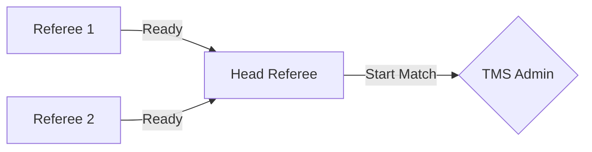
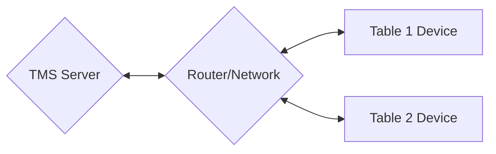

# Minimal Setup
If you are only using TMS for the Robot Games with no intention of displaying scores or schedules, then the setup is minimal. You will need:

- **Server**: A laptop or desktop to run the TMS software. And can be used to input/modify scores, and run the match timer.
- **Network**: A wireless router to connect the server and scoring devices. Or a common venue network.
- **Scoring Devices**: At least one device to input scores. This can be a laptop, tablet or similar. The recommendation is to use tablets with the web interface or iPads with the TMS App.

!!! note "Scoring Devices"
    While not necessary, there should be one device per table. This allows for multiple tables to score at the same time. This means in the smallest event with only two game tables you should have at least two scoring devices.

## Volunteer Structure
A common structure for smaller events is to have one person dedicated to running the TMS Software as the TMS Admin/Scorekeeper, who will also run the match timer on the Head Referee's word. And one person per table holding a tablet to input scores for the team. This will assume that the TMS Admin/Scorekeeper is in the same room as the tables, and can easily start the countdown.

## Device Structure
A common and minimal device structure can be seen below
